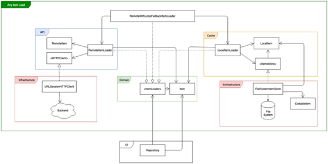

# Babylon_DemoProject
The demo project for Babylon Health

### High level requierements
  - When user opens the app a list of post titles should be shown, if available.
  - If user have no internet connection, the app should show the last cached posts.
  - If no internet connection and no cached posts, an empty page with the load button is displayed.
  - On interaction with the load button the posts load will be triggered.
  - On post selection a detail page will be shown containing the post title, body, author name and comments count.
  
### Detailed requierements
  - When user opens the app fetch the posts from the endpoint
  - Loaded data is validated and post items are created
  - Created post items are delivered to the main page
  
  - When user opens the app fetch the posts from the endpoint
  - Loaded data is validated and post items are created
  - Created post items are cached to the local storage
 
  - When user opens the app fetch the posts from the endpoint
  - If load failed, fetch from the local storage
  - Loaded data is validated and delivered to the main page
  
  - When user opens the app fetch the posts from the endpoint
  - If load failed, fetch from the local storage
  - If load from local storage fails, or no cached items, empty page with the load button is shown
  
  - Apps always tries to get the lastest data from the endpoint, if the retrieval fails,
    only then app will return the cached data
  
 ### High level tehnical analysys
   There are 4 main functiional components to be developed:
  
      1. The remote with local cache fallback:
           - When asked for data fetches the data from the remote endpoint or from the local cache
             if remote fetch failed
           - Stores the feetched data to the local storage
      2. The UI component:
           - Shows the posts list and the detail for each post - layout, navigation
           - Defines the UI models for each screens.
      3. The repository:
           - Currently only one main repo, as the app is small.
           - Responsible for asking for the data the remote with local cache fallback component
           - Applies any business logic over the received data and transforms to the apropriate models
             to be consumed by the UI component.
      4. The assembler:
           - Responsible for assembling all the components
           - Currently only one assembler as the app is small.
           
  ### Per Item tehnical details
    1. Remote with local cache fallback
       
       Key points considered:
         - This should be a generic mechanism that can be applied to any domain model on need.
         - Loading from the remote source or the local source should not have any conceptual difference, in order 
           to keep things consistent. Thus loading from the cache should have similar look and feel,
           as loading from the remote source. This means that even though the models do have a logical connection 
           between them, like the post have a relation to the user model, those are not connected by any relation
           in the local storage => no relational db. The response from the server is just cached
           without assuming any relations. Any relation maping between models will be done at the Repository level,
           in a centralized place, so there is one place for the possible changes!
         - The component should asure a good decoupling between the possible modules.
         
      There are 3 core modules:
         - Domain -> defines the domain models and domain functionality.
         - API -> defines the interaction with the remote source
         - Cache -> defines the interaction with the cache source
      
      DTOs are heavily used in this component in order to minimize the coupling between different modules.
  
      A generic mechanism is put in place a reusable component to applied to any item, the core players are:
      
      -------------------------------------------------------------------------------------------------------
      public protocol ItemsLoader {
            associatedtype Item
            func load() -> Single<[Item]>
      }
      
      Defines the loading functionality for any item type.
       -------------------------------------------------------------------------------------------------------
       
      final public class RemotePostsLoader<Item, RemoteItem: Decodable>: ItemsLoader {
          private let url: URL
          private let client: HTTPClient
    
          public typealias RemoteToPostsMapper = ([RemoteItem]) -> [Item]
          private let remoteToPostsMapper: RemoteToPostsMapper
    
          public init(url: URL,
                      client: HTTPClient,
                      mapper: @escaping RemoteToPostsMapper) {
              self.url = url
              self.client = client
              self.remoteToPostsMapper = mapper
        }....
      
      Loads any Item type from the remote source. The RemoteItem is the API module
      representation of the loaded item, a mapper is passed in order to solve the mapping.
       -------------------------------------------------------------------------------------------------------
       
       public class LocalItemsLoader<Item, LocalItem>: ItemsLoader, ItemsStorageManager {
          private let disposeBag = DisposeBag()
    
          public typealias LocalToItemMapper = ([LocalItem]) -> [Item]
          public typealias ItemToLocalMapper = ([Item]) -> [LocalItem]
          public typealias ItemType = Item

          private let store: AnyItemsStore<LocalItem>
          private let localToItemMapper: LocalToItemMapper
          private let itemToLocalMapper: ItemToLocalMapper
    
          public init(store: AnyItemsStore<LocalItem>,
                      localToItemMapper: @escaping LocalToItemMapper,
                      itemToLocalMapper: @escaping ItemToLocalMapper) {
                self.store = store
                self.localToItemMapper = localToItemMapper
               self.itemToLocalMapper = itemToLocalMapper
           }....
    
        Loads any Item type from the local source. The LocalItem is the Cache module
        representation of the loaded item, a mapper is passed in order to solve the mapping.
        Also a local item store is injected, defined below.
       -------------------------------------------------------------------------------------------------------
       
         public protocol ItemsStore {
              associatedtype ItemType
              func deleteItems() -> Completable
              func savePosts(_ items: [ItemType]) -> Completable
              func retrieve() -> Single<[ItemType]>
          }
       
        Same as ItemLoader protocol, defines the storage functionality for any item type
        -------------------------------------------------------------------------------------------------------

        public class FileSystemItemsStore<SavedItem, EncodedItem: Codable>: ItemsStore {
          public typealias ItemType = SavedItem
    
          public typealias SavedToEncodedMapper = ([SavedItem]) -> [EncodedItem]
          public typealias EcondedToSavedMapper = ([EncodedItem]) -> [SavedItem]

          private let savedToEncodedMapper: SavedToEncodedMapper
          private let econdedToSavedMapper: EcondedToSavedMapper
          private let storeURL: URL
    
          public init(storeURL: URL,
                    savedToEncodedMapper: @escaping SavedToEncodedMapper,
                    econdedToSavedMapper: @escaping EcondedToSavedMapper) {
                    ....
        
        Defines a generic file system storage for any item. The EncodedItem represents an 
        encoded represenation for the Saved Item, a mapper is passed in order to solve the mapping.
        --------------------------------------------------------------------------------------------------------
         
       By making use of the generics and mappers, two things were achieved:
          - The functionality can be applied to any item.
          - Ensures a robust separation between the modules, by enforcing the creation of the specific dtos - it
            is unwanted to have the core business items defined in domain module, to be deeply coupled with the
            remote or cache module, or even whorse with the infrastructure components.
            
            
       A high level components dependency diagram can visualized below: 
         
         
         
     2. UI:
 
        - The application uses MVVM-C design pattern to structure the UI layer.
          Each MVVM stack is a completely standalone component, without any knowledge
          of other stacks. An example - The post list does not know a thing of the post details,
          it does just display a list of titles, and triggers an event when a post is selected.
          It is the job of the coordinator to react to the event and take further action.
          Along with handling the UI navigation events, the coordinator handles the dependencies
          of the MVVM stack, and links it to the repository. Thus the MVVM stack does not know
          from where the data will come from, and repository does not know who will consumed the data,
          the coordinator decides.
          
       - So as result ViewModel does not handle the actual API calls or any other core business 
         logic, it’s meant to be as dumb as possible, it only cares about the
         handling of the data representation in the view; thus the data loading and
         other core business logic is embedded in the Repository, this allows
         developing the MVVM stack completely in separation from the API
         response or any other business logic. It is implemented with the idea that
         at the moment when the MVVM stack is about to be created the only
         available info is the UI screen itself, no other info. This allows developing developing the
         core business logic, and the MVVM stack in paralel, then those are linked toghether usin the
         repository and coordinator
       
       - Example - In the Post Detail, from the page standpoint there is a title, a description
         an author name and the number of comments displayed. Thus the VM will be implemented
         to request this info basically as strings, it will not make any mapping between
         the selected post, list of users and list comments to determine it's info, it cares
         only for showing the strings specified above.
            
    3. Repository:
        
        This component is meant to interact with the loading mechanism, get the raw business data,
        apply any other business operation over the data, and compose the models that should be shown 
        to the UI. Basically this a source from which the ViewModels get their DataModel representation 
        to work with. An example is the list of posts, even though for each post the id, userId, title and body
        is returned, the repository will expose to PostListViewModel a list of models that do contain only a title,
        as the PostListViewModel only want to show a list of titles.
        
    4. Assembler:
       
        Basically a factory that is meant to tie toghether different components and expose the necesary services
        to be used in the app. It will be injected in any component that does need to access the services, thus it
        is not a globally shared resource, it should be injected.

